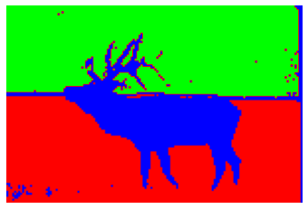
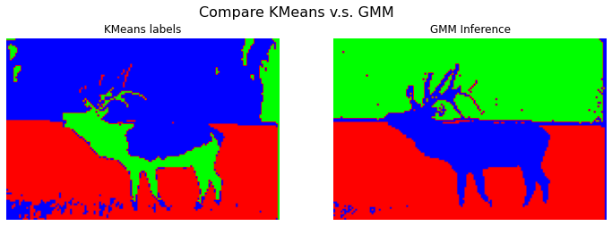

# gmm-image-segmentation
 
## Sample Output

## Sample Result
### K-Means法によるクラスタリングとギブスサンプリングによるクラスタリングの比較

### 初期の分布と推論後の分布の比較
- 点線：初期の分布
- 実線：推論後の分布

|||
|:---:|:---:|
|x軸：Rチャンネル、y軸：Gチャンネル|x軸：Gチャンネル、y軸：Bチャンネル|
