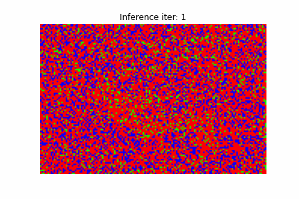
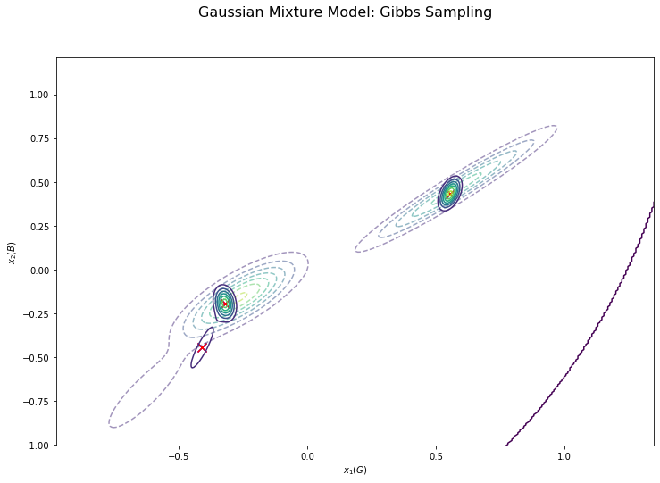

# gmm-image-segmentation
混合ガウス分布にギブスサンプリングを用いて画像のセグメンテーションを行う。
 
## Sample Output
|||
|:---:|:---:|
|クラスタリング後|入力画像と出力画像の比較|

## Sample Animation



## Sample Result
### K-Means法によるクラスタリングとギブスサンプリングによるクラスタリングの比較


### 初期の分布と推論後の分布の比較
- 点線：初期の分布
- 実線：推論後の分布

|||
|:---:|:---:|
|Rチャンネル, Gチャンネルのヒストグラム|Gチャンネル, Bチャンネルのヒストグラム|

|||
|:---:|:---:|
|x軸：Rチャンネル、y軸：Gチャンネル|x軸：Gチャンネル、y軸：Bチャンネル|

## プログラムの流れ
1. 画像の読み込みと前処理
    - 入力画像のリサイズと画素値を0.0~1.0の範囲に正規化
    - 画像を各チャンネルごとに標準化(平均0, 標準偏差1)
2. KMeans法を用いてパラメータμ、Σ、πを初期化
3. ギブスサンプリングによる推論
4. クラスタリングの結果の可視化
    - 各ピクセルごとに割り当てられたクラスタに応じて着色

## パラメータ
- クラスタ数：K = 3
- データの次元数：D = 3(RGBの3チャンネルのため)
- データ数：N = height x width
- 試行回数：MaxIter = 50
- μの事前分布：β = 1.0、m = [0, 0, 0]
- Λの事前分布：W = 3 * I, ν = 3
- πの事前分布：α = [2, 2, 2]

## アルゴリズム
疑似コード ([3]アルゴリズム4.5 ガウス混合モデルのためのギブスサンプリング)

```
パラメータのサンプルμ, Λ, πに初期値を設定
for i=1, ..., MAXITER do
    for n=1, ..., N do
        式(4.9.3)を用いてs_nをサンプル
    end for
    for k=1, ..., K do
        式(4.102)を用いてΛ_kをサンプル
        式(4.98)を用いてμ_kをサンプル
    end for
    式(4.44)を用いてπをサンプル
end for
```

## Λの事前分布のハイパーパラメータW = I * param
- I：D x Dの単位行列
- param：ハイパーパラメータ

paramの値によってセグメンテーションの結果が変化する

||||
|:---:|:---:|:---:|
|param = 0.005|param = 0.1|param = 1.0|

||||
|:---:|:---:|:---:|
|param = 2.0|param = 5.0|param = 10.0|


## 参考
[1] [【Python】4.4.2：ガウス混合モデルにおける推論：ギブスサンプリング【緑ベイズ入門のノート】](https://www.anarchive-beta.com/entry/2020/11/28/210948)

[2] [laituan245/image-segmentation-GMM](https://github.com/laituan245/image-segmentation-GMM/blob/master/main.py)

[3] [機械学習スタートアップシリーズ ベイズ推論による機械学習入門 (KS情報科学専門書) 単行本（ソフトカバー） – 2017/10/21
須山 敦志  (著), 杉山 将 (監修)](https://www.amazon.co.jp/dp/4061538322/)


## サンプルデータセット
[image-segmentation-GMM/images/](https://github.com/laituan245/image-segmentation-GMM/tree/master/images)
